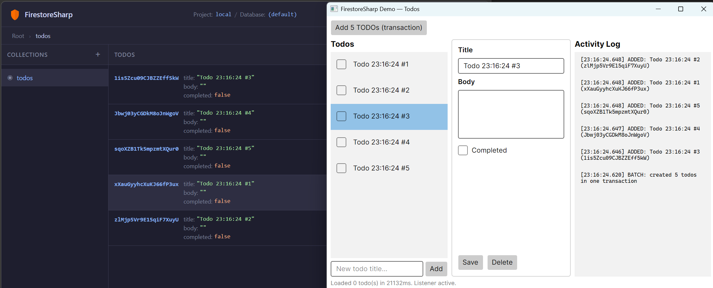

# FirestoreSharp

> This is very early stage work-in-progress. The API and design are not finalized and are subject to change.

This project is an open source .NET emulator for Google Cloud Firestore. It is designed to provide a local development environment
for testing and development purposes without the need to connect to the actual Firestore service.

The motivation behind this project is to avoid the memory challenges faced when using the official Firestore emulator. By having the
option to use a file-based storage approach, FirestoreSharp allows for larger datasets to be handled without running into
memory limitations.

## Development setup

After cloning the repo, restore the local .NET tools (used for git hooks):

```bash
dotnet tool restore
```

## Quick start

```bash
docker run --rm -p 5017:5017 -p 5018:5018 ghcr.io/mikegoatly/firestoresharp:latest
```

Then open `http://localhost:5018/ui` in a browser, and point your Firestore client at the emulator:

```bash
FIRESTORE_EMULATOR_HOST=localhost:5017
```

See [Running with Docker](#running-with-docker) for persistent storage and Docker Compose examples.

There's a demo .NET Avalonia UI that uses the official Google Firestore SDK to connect to the emulator and perform operations.
This is the demo UI and the emulator UI running side-by-side, both connected to the same emulator instance:



# Progress and Roadmap

## RPC Methods

### Document CRUD

| RPC | Request | Response | Streaming | Status |
|-----|---------|----------|-----------|-------------|
| `GetDocument` | `GetDocumentRequest` | `Document` | Unary | ✅ Done |
| `ListDocuments` | `ListDocumentsRequest` | `ListDocumentsResponse` | Unary | ✅ Done |
| `CreateDocument` | `CreateDocumentRequest` | `Document` | Unary | ✅ Done |
| `UpdateDocument` | `UpdateDocumentRequest` | `Document` | Unary | ✅ Done |
| `DeleteDocument` | `DeleteDocumentRequest` | `Empty` | Unary | ✅ Done |
| `BatchGetDocuments` | `BatchGetDocumentsRequest` | `BatchGetDocumentsResponse` | **Server streaming** | ✅ Done |

### Queries

| RPC | Request | Response | Streaming | Status |
|-----|---------|----------|-----------|-------------|
| `RunQuery` | `RunQueryRequest` | `RunQueryResponse` | **Server streaming** | ✅ Done (partial — see below) |
| `RunAggregationQuery` | `RunAggregationQueryRequest` | `RunAggregationQueryResponse` | **Server streaming** | ✅ Done (partial — see below) |
| `PartitionQuery` | `PartitionQueryRequest` | `PartitionQueryResponse` | Unary | ✅ Done |
| `ExecutePipeline` | `ExecutePipelineRequest` | `ExecutePipelineResponse` | **Server streaming** | Not implemented |

#### RunQuery — Supported StructuredQuery Features

| Feature | Status | Notes |
|---------|--------|-------|
| `from` — direct collection | ✅ | Queries documents in a single named collection |
| `from` — collection group (`all_descendants: true`) | ✅ | Queries across all subcollections with the same ID |
| `where` — `EQUAL` / `NOT_EQUAL` | ✅ | |
| `where` — `LESS_THAN` / `LESS_THAN_OR_EQUAL` | ✅ | |
| `where` — `GREATER_THAN` / `GREATER_THAN_OR_EQUAL` | ✅ | |
| `where` — `IN` / `NOT_IN` | ✅ | |
| `where` — `ARRAY_CONTAINS` / `ARRAY_CONTAINS_ANY` | ✅ | |
| `where` — `IS_NULL` / `IS_NOT_NULL` (unary) | ✅ | |
| `where` — `IS_NAN` / `IS_NOT_NAN` (unary) | ✅ | |
| `where` — composite `AND` / `OR` | ✅ | Arbitrarily nested |
| `order_by` — explicit field ordering (ASC / DESC) | ✅ | |
| `order_by` — implicit `__name__` appending | ✅ | Firestore tiebreak semantics |
| `select` — field projection | ✅ | Returns only requested fields |
| `offset` | ✅ | |
| `limit` | ✅ | |
| `__name__` pseudo-field in filters / ordering | ✅ | Resolved to `Document.Name` |
| Firestore value ordering (cross-type) | ✅ | null < bool < number < timestamp < string < bytes < reference < geo_point < array < map |
| NaN ordering (before all numbers) | ✅ | |
| `start_at` / `end_at` cursors | ❌ Not implemented | |
| `find_nearest` (vector search) | ❌ Not implemented | |
| `consistency_selector` (transactions / read_time) | ✅ | Transactions supported; `read_time` not yet supported |
| `explain_options` | ❌ Not implemented | |

#### RunAggregationQuery — Supported Features

| Feature | Status | Notes |
|---------|--------|-------|
| `COUNT(*)` | ✅ | Counts all matching documents |
| `COUNT_UP_TO(n)` | ✅ | Caps scan at `n` documents |
| `SUM(field)` | ✅ | Skips non-numeric/null; returns int64 if all integers and no overflow, else double |
| `AVG(field)` | ✅ | Always returns double; returns NULL for empty numeric set |
| NaN propagation (SUM / AVG) | ✅ | Any NaN in the field → result is NaN |
| Alias auto-assignment (`field_0`, `field_1`, …) | ✅ | Global counter, increments only for un-aliased aggregations |
| Up to 5 aggregations per query | ✅ | Returns `INVALID_ARGUMENT` if violated |
| Inner `StructuredQuery` (filters, cursors, limit, offset) | ✅ | Full query pipeline applied before aggregation |
| `consistency_selector` — existing transaction | ✅ | |
| `consistency_selector` — `new_transaction` | ✅ | Transaction ID returned in first streaming response; scanned documents recorded in the transaction read-set. Note: only documents that existed at query time are tracked — inserts of new matching documents after the read are not detected as conflicts. |
| `consistency_selector` — `read_time` | ❌ Not implemented | |
| `explain_options` | ❌ Not implemented | |

### Transactions

| RPC | Request | Response | Streaming | Status |
|-----|---------|----------|-----------|-------------|
| `BeginTransaction` | `BeginTransactionRequest` | `BeginTransactionResponse` | Unary | ✅ Done |
| `Commit` | `CommitRequest` | `CommitResponse` | Unary | ✅ Done |
| `Rollback` | `RollbackRequest` | `Empty` | Unary | ✅ Done |

#### Transactions — Supported Features

| Feature | Status | Notes |
|---------|--------|-------|
| `BeginTransaction` (ReadWrite / ReadOnly modes) | ✅ | |
| `Commit` (transactional and non-transactional) | ✅ | Atomic all-or-nothing (prepare-then-apply) |
| `Rollback` | ✅ | |
| Optimistic concurrency (read-set conflict → `ABORTED`) | ✅ | Conflicting transactions automatically aborted |
| `retry_transaction` support | ✅ | Accepted in `TransactionOptions.ReadWrite` |
| 60-second idle expiry | ✅ | |
| Transaction-scoped reads (Get, BatchGet, RunQuery) | ✅ | Read-set tracked for conflict detection |
| Read-only transaction commit (no writes) | ✅ | |
| Per-document snapshot isolation (overlay store) | ✅ | See note below |
| Pessimistic concurrency (document locking) | ❌ Not implemented | Optimistic only |
| Global snapshot isolation (true MVCC) | ❌ Not implemented | See note below |
| Write skew detection | ❌ Not implemented | See note below |
| 500-document transaction limit | ✅ | Enforced — rejects with `INVALID_ARGUMENT` |

#### Transaction Consistency — What Is and Isn't Implemented

Read-write transactions use a **per-document overlay store** for snapshot isolation. When a document is first read inside a transaction, its state is promoted into a private overlay. All subsequent reads of the same document within that transaction return the overlaid snapshot, not the live base store — so a document read twice in a transaction always returns the same value, even if another transaction committed a change in between.

**What this provides:**

- A document read multiple times within a transaction always returns the same value.
- Writes buffered in a transaction are not visible to other readers until commit.
- Intra-transaction reads see intra-transaction writes (the overlay is the prepare-phase source).
- Conflict detection (`ABORTED`) fires when a read document is externally modified before commit.

**What this does NOT provide (compared to real Firestore):**

- **Global snapshot time.** In real Firestore, all reads in a transaction see the database as of a single point in time (the transaction start). Here, the snapshot time is per-document — each document is snapshotted at the moment it is first read within the transaction. If doc A is read at T1 and doc B is read at T2 > T1, they may reflect different logical moments. In practice this window is small, but it is a difference from the real service.
- **Write skew detection.** Two transactions can each read an overlapping set of documents and each write based on what they read, without either transaction's conflict check firing, if they write to different documents. The combined effect may violate an application-level invariant. The real Firestore uses serializable snapshot isolation which detects this; FirestoreSharp does not.
- **Serializable isolation.** As a consequence of the above, FirestoreSharp provides snapshot isolation (with per-document rather than global snapshot time), not full serializability.

### Batch/Streaming Writes

| RPC | Request | Response | Streaming | Status |
|-----|---------|----------|-----------|-------------|
| `BatchWrite` | `BatchWriteRequest` | `BatchWriteResponse` | Unary | ✅ Done |
| `Write` | `WriteRequest` | `WriteResponse` | **Bidirectional streaming** | ✅ Done (partial — see below) |

#### Write — Supported Features

| Feature | Status | Notes |
|---------|--------|-------|
| Stream handshake (open stream, receive `stream_id` + `stream_token`) | ✅ | |
| Write batch per request (atomic commit) | ✅ | Reuses transaction commit semantics |
| Heartbeat (empty writes → token refresh) | ✅ | |
| `stream_token` round-trip (unique token every response) | ✅ | |
| Stream resumption (`stream_id` on open) | ❌ Not implemented | Rejected with `UNIMPLEMENTED` |

### Real-time Listeners

| RPC | Request | Response | Streaming | Status |
|-----|---------|----------|-----------|-------------|
| `Listen` | `ListenRequest` | `ListenResponse` | **Bidirectional streaming** | ✅ Done (partial — see below) |

#### Listen — Supported Features

| Feature | Status | Notes |
|---------|--------|-------|
| Document targets (watch specific documents) | ✅ | Initial snapshot + live create/update/delete notifications |
| Query targets (watch a structured query) | ✅ | Initial snapshot + live notifications for matching documents |
| `TargetChange` lifecycle (ADD, REMOVE, CURRENT) | ✅ | Sent during target registration and removal |
| `DocumentChange` notifications | ✅ | Sent when a watched/matching document is created or updated |
| `DocumentDelete` notifications | ✅ | Sent when a watched/matching document is deleted |
| `DocumentRemove` notifications | ✅ | Sent when a document no longer matches a query target |
| Multiple targets per stream | ✅ | Add/remove targets dynamically |
| Target ID auto-assignment (`target_id = 0`) | ✅ | Server assigns a unique ID |
| Resume tokens (`resume_token` / `read_time`) | ❌ Not implemented | |
| `ExistenceFilter` / BloomFilter reconciliation | ✅ Implemented | Sent after `CURRENT` on every target registration |
| `once` flag (single snapshot then remove) | ✅ Done | |
| Limit-based removal tracking | ❌ Not implemented | Query limit overflow won't send `DocumentRemove` |

### Collection Management

| RPC | Request | Response | Streaming | Status |
|-----|---------|----------|-----------|-------------|
| `ListCollectionIds` | `ListCollectionIdsRequest` | `ListCollectionIdsResponse` | Unary | ✅ Done |

## Storage Layer

- File-based storage implementation
- In-memory storage implementation

## Running with Docker

Pre-built images are published to the GitHub Container Registry on every release:

```
ghcr.io/mikegoatly/firestoresharp:latest
ghcr.io/mikegoatly/firestoresharp:<version>
```

### Ports

| Port | Purpose |
|------|---------|
| `5017` | gRPC endpoint (HTTP/2) — point your Firestore client here |
| `5018` | Web UI (HTTP/1.1) — open in a browser to inspect and edit data |

### Quick start (in-memory store)

```bash
docker run --rm -p 5017:5017 -p 5018:5018 ghcr.io/mikegoatly/firestoresharp:latest
```

Then open `http://localhost:5018/ui` in a browser, and point your Firestore client at the emulator:

```bash
FIRESTORE_EMULATOR_HOST=localhost:5017
```

### Persistent storage

Mount a host directory and use the file-system store to keep data between container restarts:

**Bash:**
```bash
docker run --rm \
  -p 5017:5017 \
  -p 5018:5018 \
  -v /path/to/data:/data \
  ghcr.io/mikegoatly/firestoresharp:latest \
  --store FileSystem --store-path /data
```

**PowerShell:**
```powershell
docker run --rm `
  -p 5017:5017 `
  -p 5018:5018 `
  -v \path\to\data:/data `
  ghcr.io/mikegoatly/firestoresharp:latest `
  --store FileSystem --store-path /data
```

### Docker Compose example

```yaml
services:
  firestore:
    image: ghcr.io/mikegoatly/firestoresharp:latest
    ports:
      - "5017:5017"   # gRPC
      - "5018:5018"   # Web UI
    volumes:
      - firestore-data:/data
    command: ["--store", "FileSystem", "--store-path", "/data"]

volumes:
  firestore-data:
```